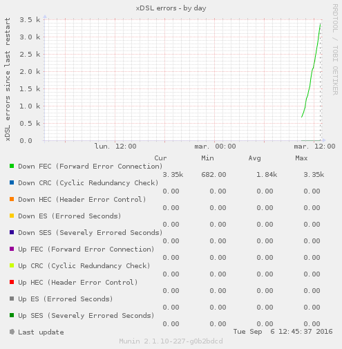
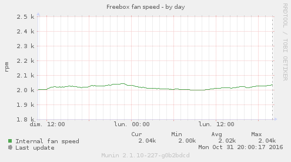
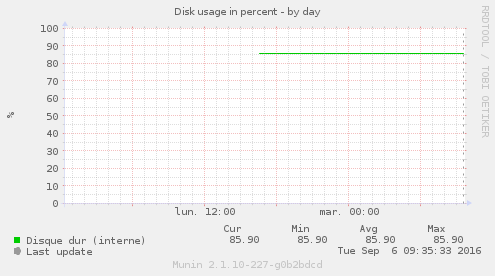
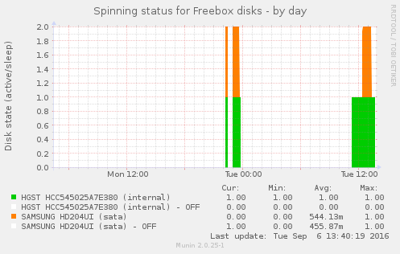
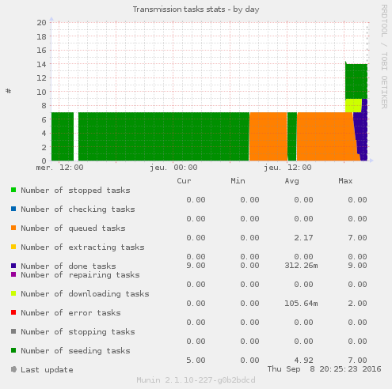
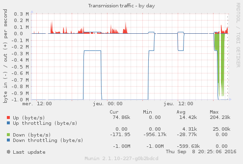
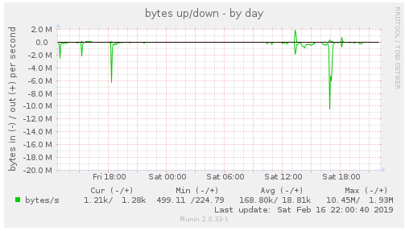
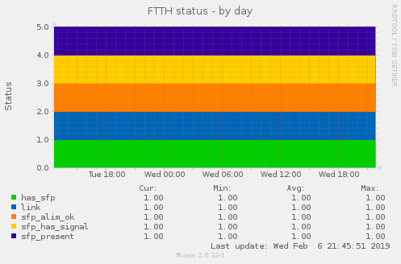

# Freebox-OS-munin
*Freebox Revolution & Freebox 4K's stats monitoring using munin*

This script has been tested upon Python 2.7, 3.2 & 3.5. See [below](#graphs) for some screenshots

## Usage

1. This plugin relies on `requests`: (replace `pip` with the version you use)

    ```bash
    pip install requests
    ```

2. Clone this project on your server:
    
    ```bash
    git clone https://github.com/chteuchteu/Freebox-OS-munin.git && cd Freebox-OS-munin
    clone_path=$(pwd)
    ```

3. Launch authorization script

    ```bash
    ./main.py authorize
    ```

4. Update permissions on authorization file

    ```bash
    chmod 0660 ./freebox.json
    sudo chgrp munin freebox.json
    ```

5. Install the plugins

    > Tip: you don't have to symlink each mode. Skip some if you don't need all information

    ```bash
    ./create_symlinks.py
    cd /etc/munin/plugins
    ln -s "$clone_path"/freebox-*
    
    service munin-node restart
    ```

6. Restart munin node service
   ```bash
   sudo service munin-node restart
   ```

7. Test it

    ```
    munin-run freebox-traffic
    ```

## Contribute
Fork this repository, and submit pull requests upon master branch.

> Tip: when making changes that affects all plugins, you can tests them all
by running `./main.py --mode all`. This will execute each plugin in both config
& poll modes.

## Graphs
- freebox-traffic  
    
- freebox-xdsl  
    
- freebox-xdsl-errors  
    
- freebox-temp  
    
- freebox-fan-speed  
    
- freebox-switch1 (1..4)  
    
- freebox-df  
    
- freebox-hddspin  
    
- freebox-transmission-tasks  
    
- freebox-transmission-traffic  
    
- freebox-connection
    
- freebox-ftth
    
