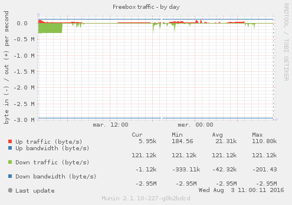
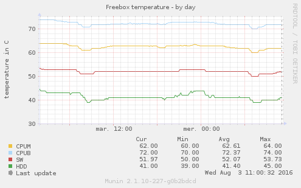
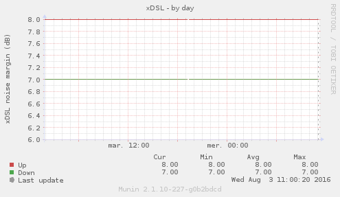
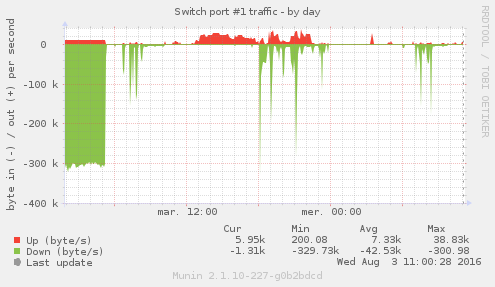
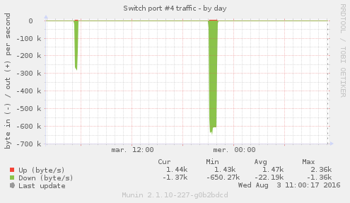

# Freebox-Revolution-munin
*Watch Freebox Revolution's networking stats using munin*

|  |  |  |  | ... |  |
|:---:|:---:|:---:|:---:|:---:|:---:|
| freebox-traffic | freebox-xdsl | freebox-temp | freebox-switch1 | ... | freebox-switch4 |

## Usage

1. Clone this project on your server:
    
    ```bash
    git clone https://github.com/chteuchteu/Freebox-Revolution-munin.git && cd Freebox-Revolution-munin
    clone_path=$(pwd)
    ```

2. Launch authorization script

    ```bash
    ./main.py authorize
    ```

3. Install the plugins

    ```bash
    ln -s "$clone_path"/main.py /etc/munin/plugins/freebox-traffic
    ln -s "$clone_path"/main.py /etc/munin/plugins/freebox-temp
    ln -s "$clone_path"/main.py /etc/munin/plugins/freebox-xdsl
    ln -s "$clone_path"/main.py /etc/munin/plugins/freebox-switch1
    ln -s "$clone_path"/main.py /etc/munin/plugins/freebox-switch2
    ln -s "$clone_path"/main.py /etc/munin/plugins/freebox-switch3
    ln -s "$clone_path"/main.py /etc/munin/plugins/freebox-switch4
    
    service munin-node restart
    ```

4. Test it

    ```
    munin-run freebox-traffic
    ```
